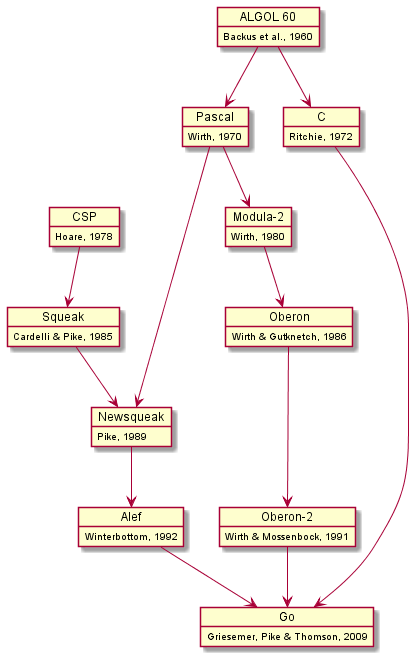
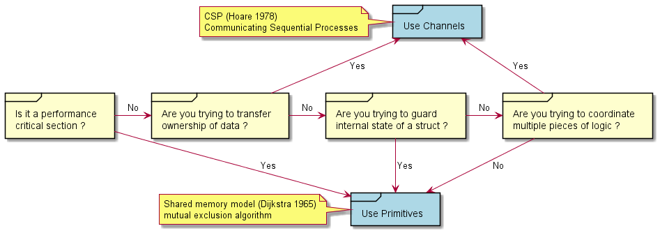
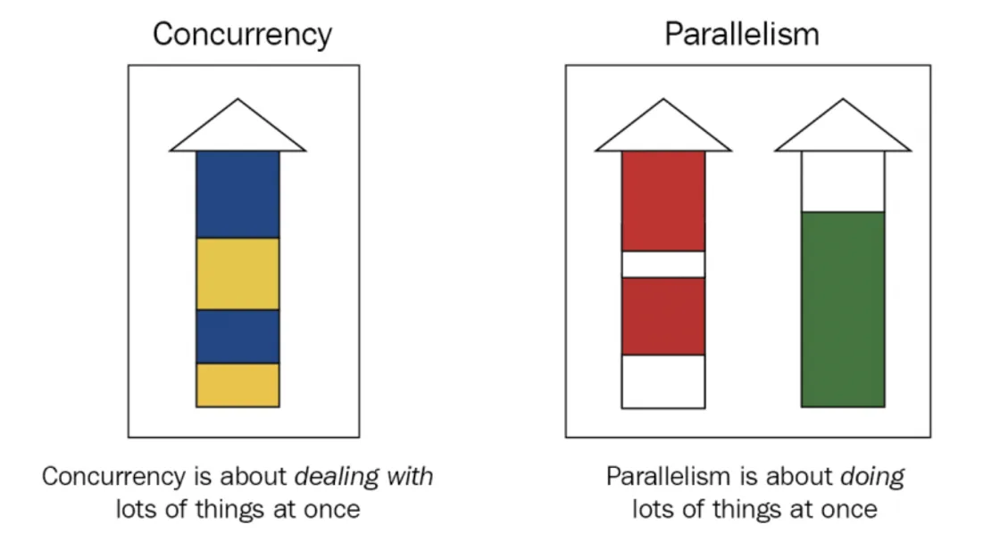
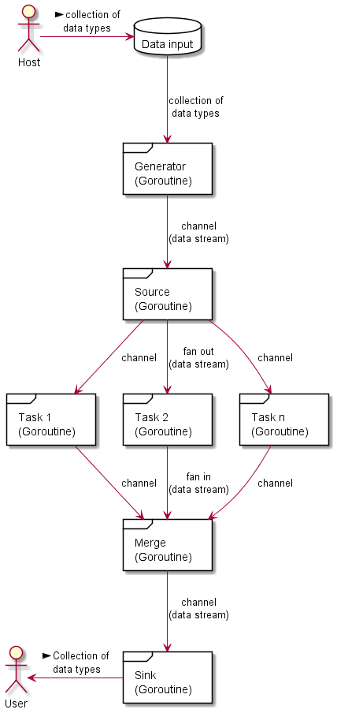
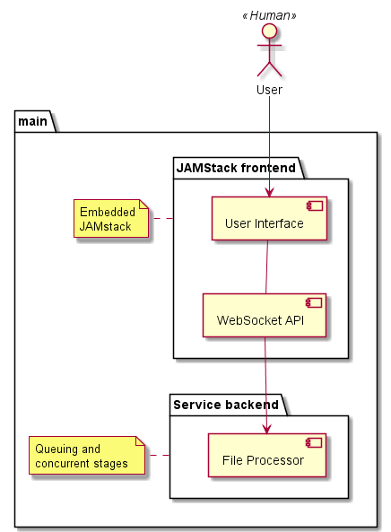

# Pipelines

## Key concepts
#### The origins of Go

Go is sometimes described as a *C-like language*, or as *C for the 21st century*. From C, Go inherited its expression syntax, control-flow statements ... Go is sometimes referred to as a Model T Ford with a Ferrari engine. (thanks to [Scriptol](https://www.scriptol.fr/programmation/go.php))


The figure below shows the most important influences of earlier programming languages on the design of Go (thanks to [O'Reilly](https://www.oreilly.com/library/view/the-go-programming/9780134190570/ebook_split_005.html)).



#### CSP
Communicating Sequential Processes (CSP) is a formal language for describing patterns of interaction in concurrent systems. CSP is the favored model but SHM is still available.



#### Concurrency vs Parallelism
Concurrency is an ability of a program to do multiple things at the same time. Parallelism is a run-time property where two or more tasks are being executed simultaneously (thanks to [Fan-In Fan-Out Concurrency Pattern](https://kapoorrahul.medium.com/golang-fan-in-fan-out-concurrency-pattern-f5a29ff1f93b)).

 

#### Pipes and Filters 
Pipes and Filters is a pattern to break down a business processing into a set of separate components (i.e. the filters), each performing a single task. A pipeline connects filters with pipes. Filters are independent, self-contained, and typically stateless. Filters receive messages from an inbound pipe and publish messages to a different outbound pipe.

 If the input and output of a filter are structured as a stream, you can perform the processing for each filter in parallel. The first filter in the pipeline can start its work and output its results, which are passed directly to the next filter in the sequence before the first filter completes its work.


#### Batch and stream processing
Most of time, we describe a pipeline as a series of stages. A pipeline separates the concerns of each stage. Stages can perform what we call batch processing i.e., they operate on chunks of data all at once, instead of one discrete value at a time e.g., in a procedural code. When the pipeline stages receive and emit only one element at a time, we call it stream processing. 

#### Goroutines and Channels

A goroutine is a function that runs independently of the function that started it. we could explain a goroutine as a function that runs as if it were on its own thread. A channel is a pipeline for sending and receiving data. A Channel is like a socket that runs inside a program. Channels provide a way for one goroutine to send structured data to another.

#### Fan Out and Fan In
Fan out is used when multiple functions read from the same channel. The reading will stop only when the channel is closed. This characteristic is often used to distribute work amongst a group of workers to parallelize the CPU and I /O.
Fan In is used when a single function reads from multiple inputs and proceeds until all are closed. This is made possible by multiplexing the input into a single channel.



## Code snippets

#### 00-stage 
*00-stage* illustrates a batch processing pipeline i.e., when the stages operate on chunks of data all at once. Below is a single stage.
```go
	multiply := func(values []int, multiplier int) []int {
		multipliedValues := make([]int, len(values))
		for i, v := range values {
			multipliedValues[i] = v * multiplier
		}
		return multipliedValues
	}
```
The original data remains unaltered but with an increase of memory footprint.
```go
	ints := []int{1, 2, 3, 4}
	for _, v := range multiply(add(multiply(ints, 2), 1), 2) {
		fmt.Println(v)
	}
```

#### 01-stage 
01-stage illustrates a stream processing pipeline i.e., when the pipeline stages receive and emit only one element at a time. Below is a single stage.
```go
	multiply := func(value, multiplier int) int {
		return value * multiplier
	}
```
Each stage is receiving and emitting a discrete value so that the memory footprint is only the size of the pipeline input.
```go
	ints := []int{1, 2, 3, 4}
	for _, v := range ints {
		fmt.Println(multiply(add(multiply(v, 2), 1), 2))
	}
```
#### 02-stage
A first stage is a generator function which takes a variadic slice of integers and convert this discrete set of values into a stream of data on a channel.

```go
	generator := func(done <-chan interface{}, integers ...int) <-chan int {
		intStream := make(chan int)
		go func() {
			defer close(intStream)
			for _, i := range integers {
				select {
				case <-done:
					return
				case intStream <- i:
				}
			}
		}()
		return intStream
	}
```    
02-stage introduces concurrency in the pipeline with Go's channel primitives.Channels receives and emits value that can safely be used concurently.

```go
	add := func(
		done <-chan interface{},
		intStream <-chan int,
		additive int,
	) <-chan int {
		addedStream := make(chan int)
		go func() {
			defer close(addedStream)
			for i := range intStream {
				select {
				case <-done:
					return
				case addedStream <- i + additive:
				}
			}
		}()
		return addedStream
	}
```
The first thing 02-stage will do is to create a done channel and call close on it in a defer statement.
```go
	done := make(chan interface{})
	defer close(done)

	intStream := generator(done, 1, 2, 3, 4)
	pipeline := multiply(done, add(done, multiply(done, intStream, 2), 1), 2)

	for v := range pipeline {
		fmt.Println(v)
	}
```
We now have a pipeline that runs  stages concurrently.
#### 03-queuing
Sometimes it is useful to begin accepting work for a pipeline even if it is not ready for more. This process is called *queuing*.

```go
func BenchmarkUnbufferedWrite(b *testing.B) {
	performWrite(b, tmpFileOrFatal())
}

func BenchmarkBufferedWrite(b *testing.B) {
	bufferredFile := bufio.NewWriter(tmpFileOrFatal())
	performWrite(b, bufio.NewWriter(bufferredFile))
}
```

#### 04-fprocessor
File Processor (fp)

A [JAMstack](https://en.wikipedia.org/wiki/JAMstack) is a web development architecture pattern and solution stack. The acronym *JAM* stands for JavaScript, API and Markup (all generated by a static site generator). In a JAMstack website, the application logic typically resides on the client side, without being tightly coupled to a backend server.

